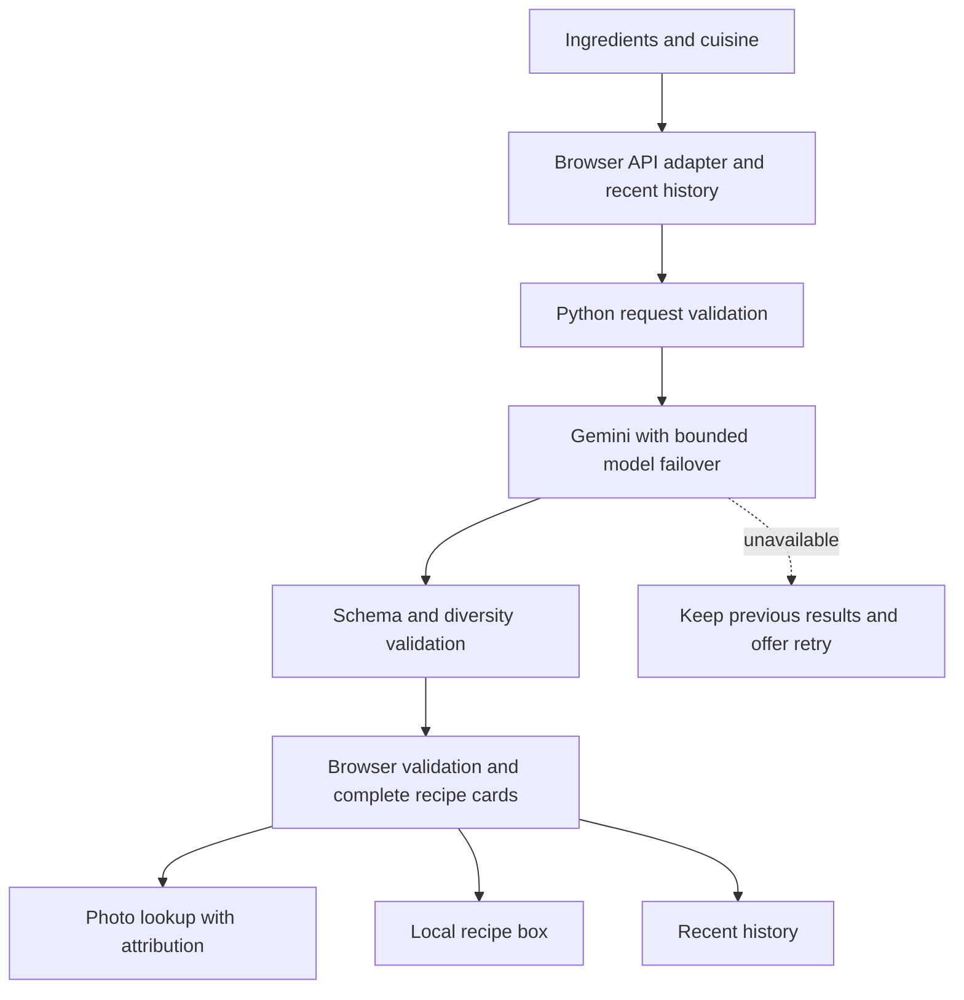

# Platera: Technical Explanations

This document explains the current project from the browser entry point to each user interaction. It is written so a new contributor, reviewer, or admissions reader can understand both the implementation and the reasoning behind it.

## 1. Product Model

Platera has a static browser interface and a required local Python gateway. The interface accepts ingredients and a cuisine selection. It currently requests two servings, unrestricted diet, and normal cooking time; the API supports additional values for these constraints.

The gateway produces exactly three recipes with measured ingredients, optional flags, 5 to 8 short numbered instructions, cooking times, difficulty, storage, chef tips, common mistakes, estimated nutrition, and five quality scores. Text length is limited by both the prompt (`BREVITY` section) and the schema (`maxItems`/`maxLength`), so recipes are quick to read at the stove. Automatic selection requires distinct cuisines. Selecting one cuisine overrides cuisine diversity, but not repeated dish names.

The important design decision is that Platera offers alternatives and exposes trade-offs. It does not claim that one generated recipe is objectively correct.

## 2. Technology Stack

### Browser platform

- **HTML5** provides semantic structure, labels, form controls, navigation, modal dialog structure, and accessible status messaging.
- **Tailwind CDN and custom CSS** provide layout utilities, the original dark patterned background, responsive recipe cards, and native dialog styling. There is no JavaScript build step.
- **Modern JavaScript ES modules** provide the application logic. The browser loads `js/main.js`, which imports `js/aiService.js`.
- **Web Storage API** persists saved recipes under `platera-recipes` and recent summaries under `platera-recipe-history`.
- **Fetch API** calls `/api/recipes`, `/api/images`, and `/api/cuisines`. Credentials never live in the browser.
- **Python** serves the app through `ThreadingHTTPServer`, calls Gemini with `urllib`, loads local configuration with `python-dotenv`, and validates JSON with `jsonschema`.
- **Playwright/Chromium** supports public photo lookup and isolated browser regression tests.

### External assets

Google Fonts supplies Playfair Display and Roboto. The hero uses an Unsplash photo. Recipe cards request dish-specific web photos with source links. They are reference images, not AI-generated images or evidence that the recipe was cooked. Google verification challenges are not bypassed; Wikipedia and Wikimedia Commons provide the working fallback. When no matching photo exists, the card hides the empty image box and links the dish name to Google Images.

## 3. File-by-File Guide

### `index.html`

This is the application shell and the only maintained entry point. It defines:

- the brand header and navigation anchors
- the original food-photo hero
- the ingredient input, cuisine selector, and history controls
- the hidden results and recipe-box sections
- numbered cooking steps, helper dialogs, and live status feedback
- the module script import for `js/main.js`

The page uses real form labels, semantic sections, button types, alternative text, and `aria-live` for feedback. Results are initially hidden so the first view stays focused on the brief.

### `css/style.css`

This preserves the original patterned background, typography, shadows, recipe image dimensions, wrapping behavior, and source captions. Native `<dialog>` elements support Escape, modal focus behavior, and focus restoration. Tailwind utilities in the markup supply most layout and control styling.

### `js/aiService.js`

This module owns the recipe API boundary and recent history.

1. `generateRecipes` sends ingredients, constraints, and `PREVIOUS_RECIPE_HISTORY` to the gateway with a 250-second browser timeout.
2. `validateRecipes` checks nested fields, exactly three dishes, cuisine rules, scores, nutrition, and ingredient measurements before rendering or remembering results.
3. `summarizeHistory` bounds names, cuisines, ingredients, instructions, and the 60-entry history size.
4. `getRecipeHistory` returns a copy; `clearRecipeHistory` clears recent history without deleting the recipe box.
5. `calculateImpact` remains an exported compatibility utility; the current screen does not render an impact strip.

There is no local template generator. Invalid or unavailable provider output does not become a fabricated recipe. Failed requests leave history unchanged.

### `js/main.js`

This module is the browser controller.

- `$` is a small DOM lookup helper.
- `state` holds generated recipes, saved recipes, and cuisine-loading status.
- `escapeHtml` protects user- and model-shaped strings before inserting them into HTML.
- `readSavedRecipes` rejects malformed entries while retaining readable legacy recipes.
- `saveRecipes` updates the recipe box even if persistence fails, with an explicit session-only notice.
- `createRecipeCard` renders ingredients and numbered cooking steps first, a one-line nutrition estimate, and a collapsed `<details>` section holding chef tips, common mistakes, storage advice, and scores.
- `displaySavedRecipes` provides reopen and delete actions.
- `handleGenerate` retains the prior result while loading and presents actionable recovery after failure.
- `imageFor` deduplicates photo requests; `connectImageState` renders matching images, source links, attribution, and thumbnail recovery. If no photo is found, it hides the image box and turns the dish name into a Google Images link.

Buttons are bound directly when cards are created. HTTP failures never replace the entire page or remove the last successful result. The helper dialogs currently contain local substitution and wine guidance rather than additional Gemini calls; they are not independently verified recommendations.

### `server.py`

`validate_request` bounds input and validates constraints and history. `CULINARY_INSTRUCTIONS` requests ingredient-first reasoning, private consideration of at least 20 candidates, diverse culinary identities, optional-ingredient honesty, safe cooking guidance, and estimated scores. The hidden candidate count and culinary correctness are prompting goals, not externally provable properties.

`generate_recipe_response` requests schema-constrained JSON, discards thought parts, rejects unfinished responses, and applies `RECIPE_VALIDATOR` plus duplicate, cuisine, and serving checks. Structurally invalid output can receive one regeneration attempt. Nutrition, taste, technique diversity, and real-world cookability still need independent evaluation.

`gemini_request` keeps the key in the `x-goog-api-key` header. `GEMINI_RECIPE_MODEL` defaults to `gemini-2.5-flash`; Google can reject it for new users despite listing it. Configurable `GEMINI_FALLBACK_MODELS` defaults to `gemini-3.8-flash,gemini-3.5-flash-lite`. The gateway tries at most three distinct models on retirement, transient server failure, timeout, or unreadable output, using a 110-second scheduling budget and at most 90 seconds per network operation. Authentication, permission, and quota failures stop automatic retries. Provider bodies and credentials are not returned to the browser.

Static serving permits only the app entry point and JS/CSS assets. Configuration, Python source, and caches are blocked. The process binds to loopback; it is a development server, not a production hosting stack.

### `image_service.py`

The photo service tries sources in order:

1. **Google Images** through headless Chromium. Google usually serves a verification page to automation; this is never bypassed, and Google lookups then pause for 30 minutes.
2. **Exact Wikipedia page** for the dish name, including a capitalization retry. A page whose title does not match is skipped rather than treated as fatal.
3. **Wikipedia and Wikimedia Commons search** (`search_public_photo`). Each result title is scored by word overlap with the dish name (accents and filler words such as "con" or "with" ignored) and accepted only at 0.5 or higher, so a lookalike dish is rejected. Only HTTPS `upload.wikimedia.org` or `thumb.wikimedia.org` images and Commons or Wikipedia source pages are accepted.

Each source fails independently, so a rate limit on one does not discard the other. Successful lookups are cached. No unrelated stock photo is substituted; if nothing matches, the browser links the dish name to Google Images and the cooking instructions remain available.

### Regression Tests

`test_server.py` covers contracts, history, cuisine overrides, bounded retries, model failover, key handling, static-file protection, and photo matching and search fallback. `test_ui.py` uses isolated Chromium contexts and mocked provider/photo responses to test corrupt storage, session saving, retry behavior, history, reopening, photo display, collapsed details, the no-photo Google Images link, and dialog keyboard interaction. In total there are 38 tests, and none require real paid generations.

### `EXPLANATIONS.md`

This document is the technical companion to the README. It explains implementation decisions, privacy boundaries, data flow, and a reasonable path toward evaluation.

### `PLATERA APP/`

This is an older duplicated layout kept for history and compatibility. Its JavaScript files are now thin imports of the root modules, which prevents the project from having two conflicting implementations. The root `index.html` is the maintained demo entry point.

### `PLATERA APP/.dist/`

This contains an old exported HTML snapshot and a test marker. It is not the maintained entry point. It is preserved as an artifact rather than silently deleted.

## 4. End-to-End Data Flow



## 5. Why Local-First?

The first prototype made the generate button dependent on Firebase authentication and embedded a Gemini credential in client-side code. That created three problems:

1. The main interaction failed when the app was opened outside its original hosted runtime.
2. A browser-visible API key could be copied and abused.
3. The project could not be evaluated easily by someone cloning it.

The current app needs no application account, but live generation does require a valid Google project key and internet access. Recipe-box storage stays in the browser. Generating sends the entered ingredients, constraints, and bounded history summaries to Google; image lookup sends dish names and cuisine terms to public sources. If browser storage fails, saved dishes remain available for that visit only.

## 6. API Contract

The implemented `POST /api/recipes` endpoint accepts:

```json
{
  "ingredients": "chickpeas, spinach, rice",
  "options": {
    "time": "normal",
    "servings": 2,
    "diet": "vegetarian",
    "cuisine": "auto"
  },
  "PREVIOUS_RECIPE_HISTORY": []
}
```

Success is an object with exactly one `recipes` property containing three entries. Each entry includes `name`, `cuisine`, `difficulty`, integer `servings`, `prepTime`, `cookTime`, integer `calories`, `scores`, `ingredients`, `instructions`, `chefTips`, `commonMistakes`, `storageAdvice`, and `nutrition`. Ingredient objects contain `name`, `amount`, and boolean `optional`. The canonical schema is `RECIPE_SCHEMA` in `server.py`.

`GET /api/cuisines` returns the supported cuisine list. `GET /api/images?dish=...&cuisine=...` returns photo metadata, not image bytes. Failures use an appropriate HTTP status and a sanitized JSON `error` string. No implementation can guarantee an external provider is always online; recovery preserves user work rather than claiming success.

For public deployment, add authentication, per-user rate limits, HTTPS, concurrency controls, privacy-reviewed logs, and a production application server. Keys accidentally shared in chat or committed to a repository must be revoked and replaced.

## 7. What Makes This SOP-Ready

The project is stronger when presented as an experiment rather than as a claim that an LLM can write recipes. A good project narrative is:

- **Problem:** household food waste and decision fatigue are related to poor use of constraints.
- **Intervention:** give users three transparent, constraint-aware routes from what they already own.
- **Engineering:** local-first browser application with a replaceable AI provider boundary.
- **Evaluation:** measure ingredient coverage, dietary compliance, preparation time accuracy, perceived usefulness, and whether users choose to cook before shopping.
- **Next question:** does explaining the trade-off behind a recommendation make people more willing to use leftovers?

That framing connects frontend engineering, AI systems, explainability, and sustainability without pretending the prototype has already proven a research result.
